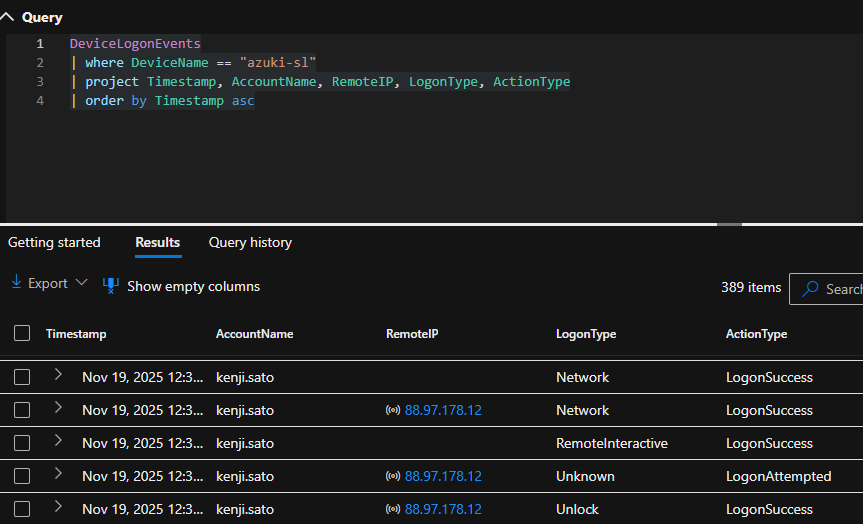
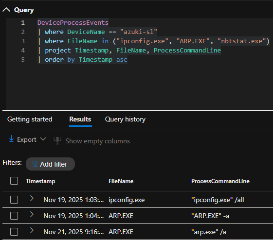
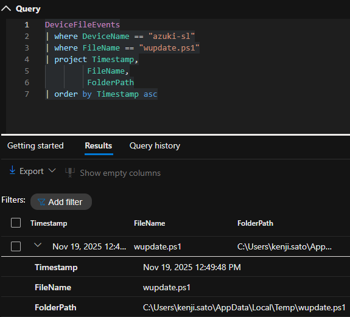
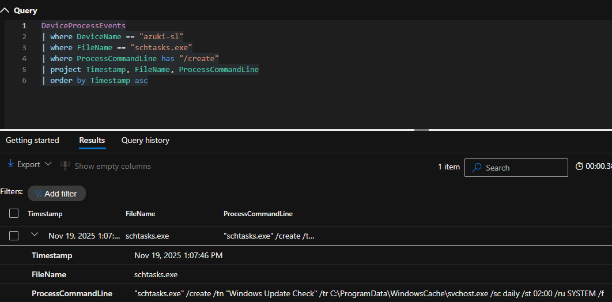
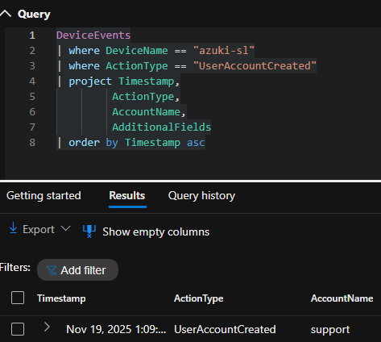
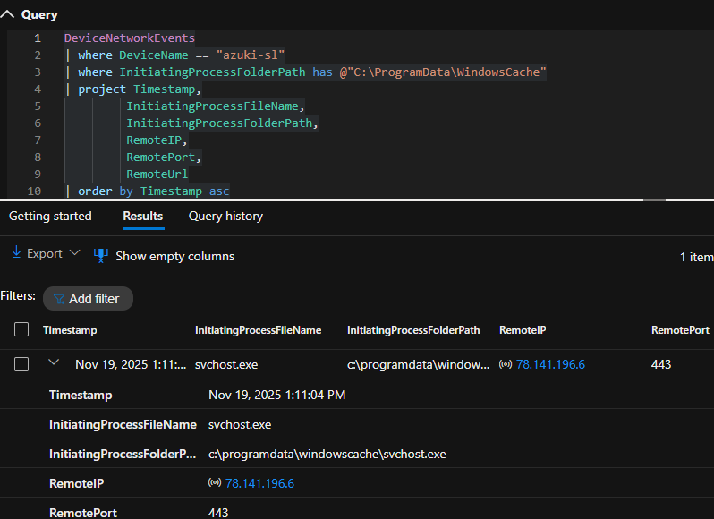
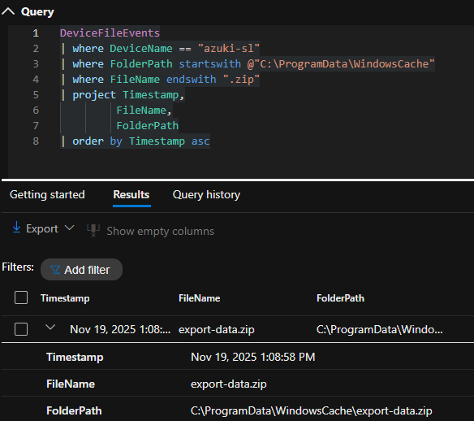
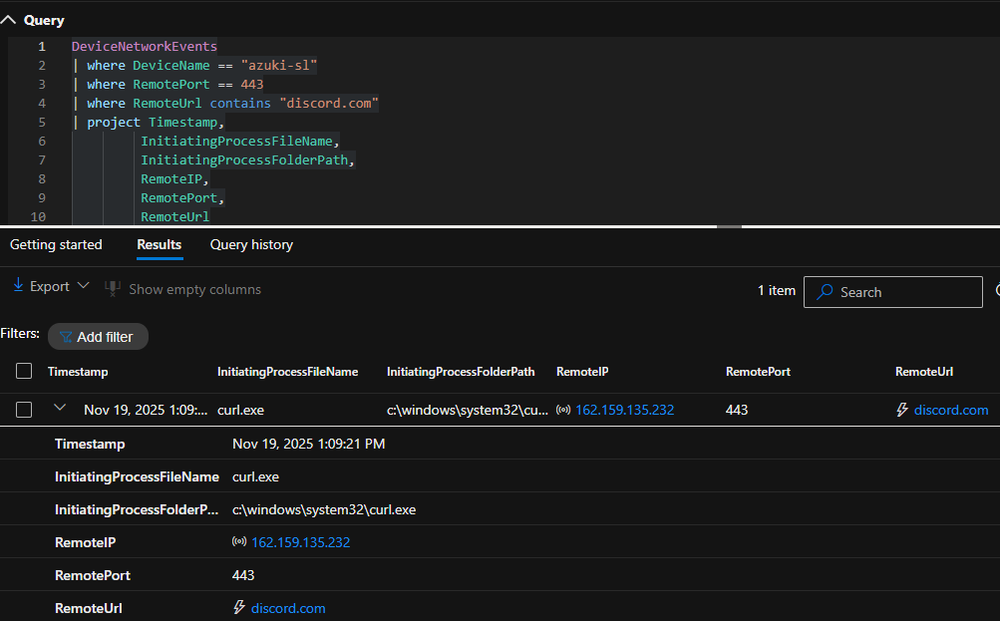
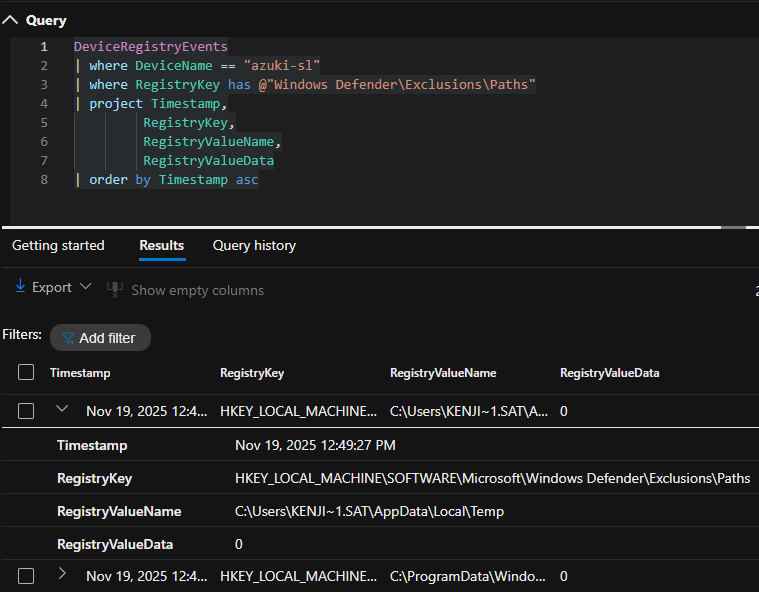
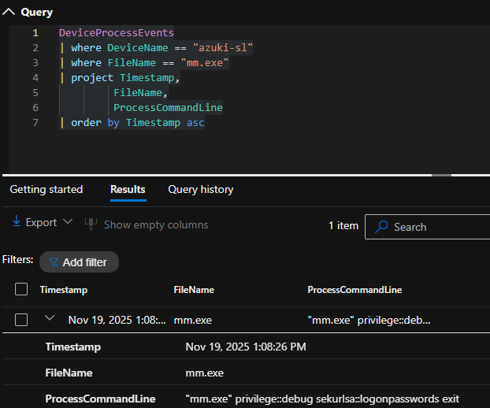

# INCIDENT RESPONSE REPORT

Report ID: INC-2025-PORT-ENTRY  
Analyst: Bryan Gilmore II  
Investigation Date: 22-November-2025
Incident Date: 19-November-2025  

---

## EXECUTIVE SUMMARY

Azuki Import/Export experienced a targeted intrusion attributed to the threat group “Jade Spider”, a financially motivated actor that focuses on logistics companies in East Asia. The attacker gained initial access via exposed RDP on the IT admin workstation `AZUKI-SL` by using the credentials of employee `kenji.sato`. After establishing a foothold, the attacker disabled security controls, staged tools in a hidden directory, stole credentials from memory, collected sensitive contract and pricing data, and exfiltrated the information to Discord over HTTPS.  

The attacker also created a backdoor local administrator account and cleared Windows event logs to hinder detection and future investigation. There is no evidence of ransomware deployment in this incident, but the stolen data appeared on underground forums and the techniques observed match Jade Spider’s known tradecraft. Impact is assessed as **High**, and the incident status is **Contained and Eradicated** based on the remediation actions listed below.

**Impact Level:** ☑ High  
**Status:** ☑ Contained  ☑ Eradicated  ☐ In Progress  

---

## INCIDENT DETAILS

### Timeline

- **First Malicious Activity (UTC):** 2025-11-19 12:36:21; initial RDP logon to AZUKI-SL as `kenji.sato` from 88.97.178.12.
- **Last Observed Activity (UTC):** 2025-11-19 18:54:05; later RDP logon to AZUKI-SL as `kenji.sato`.
- **Total Duration:** Approximately 6 hours 18 minutes.

### Attack Overview

- **Initial Access Method:** Remote Desktop Protocol from the internet (External Remote Services)  
- **Compromised Account:** `kenji.sato`  
- **Affected System:** `AZUKI-SL` (IT admin workstation)  
- **Attacker IP Address:** `88.97.178.12` (source of RDP session)  

---

## Attack Chain (What did the attacker do?)

### Initial Access (TA0001)

The attacker connected to `AZUKI-SL` over Remote Desktop from public IP `88.97.178.12` and successfully authenticated as `kenji.sato`. These interactive logons were identified in the `DeviceLogonEvents` table, filtered by `DeviceName == "azuki-sl"` and remote logon types. This activity matches **T1133 External Remote Services**.

### Execution (TA0002)

Once logged in, the attacker executed built-in Windows tools, including `arp.exe`, `ipconfig.exe`, and `certutil.exe`, as well as a malicious PowerShell script `wupdate.ps1`. The script was used to automate parts of the attack chain and interact with staged binaries in `C:\ProgramData\WindowsCache\`. This aligns with **T1059.001 Command and Scripting Interpreter: PowerShell**.

### Persistence (TA0003)

The attacker established persistence via a scheduled task:

- Task name: **“Windows Update Check”**  
- Command: `C:\ProgramData\WindowsCache\svchost.exe`  
- Frequency: daily, running as SYSTEM

This was observed in `DeviceProcessEvents` through `schtasks.exe /create` activity and maps to **T1053.005 Scheduled Task**.

### Defense Evasion (TA0005)

The attacker disabled or weakened security controls in several ways:

- Added multiple file extension exclusions to Microsoft Defender (`.bat`, `.ps1`, `.exe`, and others) under `Windows Defender\Exclusions\Extensions`.
- Added folder path exclusions, including a temp directory and the staging folder, under `Windows Defender\Exclusions\Paths`.
- Staged all malicious tools in a hidden-like directory: `C:\ProgramData\WindowsCache\`.

These changes were identified in `DeviceRegistryEvents` and correspond to **T1562.001 Impair Defenses: Disable or Modify Tools** and **T1564.012 Hide Artifacts: File/Path Exclusions**.

### Discovery (TA0007)

The attacker performed basic network reconnaissance to identify local network neighbours and potential lateral movement targets:

- Executed `arp.exe -a` on `AZUKI-SL`.

This behaviour was captured in `DeviceProcessEvents` and maps to **T1016 System Network Configuration Discovery**.

### Credential Access (TA0006)

A credential dumping tool was downloaded and executed from the staging directory:

- Filename: `mm.exe`  
- Command line: `mm.exe "sekurlsa::logonpasswords"`  

This indicates LSASS credential dumping via a Mimikatz-like tool. Events were seen in `DeviceProcessEvents`, consistent with **T1003.001 OS Credential Dumping: LSASS Memory**.

### Lateral Movement (TA0008)

After obtaining credentials, the attacker prepared and attempted RDP-based lateral movement:

- `cmdkey.exe /generic:10.1.0.188 ...` used to cache credentials.  
- `mstsc.exe /v:10.1.0.188` used to initiate a Remote Desktop session.

These actions were observed in `DeviceProcessEvents` and align with **T1550 Use Alternate Authentication Material** and **T1021.001 Remote Services (RDP)**.

### Collection (TA0009)

The attacker compressed data prior to exfiltration:

- Archive file created: `export-data.zip`  
- Location: `C:\ProgramData\WindowsCache\`

This was identified via `DeviceFileEvents` and maps to **T1560 Archive Collected Data**.

### Command & Control (TA0011)

Malware staged in `C:\ProgramData\WindowsCache\` established outbound command and control:

- C2 Executable: `svchost.exe` (malicious copy in WindowsCache)  
- C2 Address: `78.141.196.6`  
- C2 Port: `443` (HTTPS)

Outbound connections were observed in `DeviceNetworkEvents`, and the activity matches **T1105 Ingress Tool Transfer** and C2 over HTTPS.

### Exfiltration (TA0010)

The attacker exfiltrated data using a web service rather than direct C2:

- Tool: `curl.exe`  
- Destination: `discord.com` over port 443  
- Likely payload: `export-data.zip` from the staging directory

This method aligns with **T1567 Exfiltration Over Web Service**.

### Impact (TA0040)

Although there was no ransomware execution in this scenario, the attacker:

- Created a backdoor local account `support` with elevated rights, providing persistent access.  
- Cleared the Windows Security event log with `wevtutil.exe cl Security`, destroying valuable audit data.  

These actions increased long-term risk to the environment and hindered investigation. They map to **T1136.001 Create Account: Local Account** and **T1070.001 Clear Windows Event Logs**.

---

## KEY FINDINGS

### Primary IOCs

- **Malicious IPs:**
  - `88.97.178.12` – source of initial RDP access to `AZUKI-SL`.  
  - `78.141.196.6` – C2 server contacted by malware in `C:\ProgramData\WindowsCache\`.

- **Malicious Files:**
  - `C:\ProgramData\WindowsCache\svchost.exe` – C2 beacon and scheduled task target.  
  - `C:\ProgramData\WindowsCache\mm.exe` – credential dumping tool.  
  - `C:\ProgramData\WindowsCache\export-data.zip` – staged archive of stolen data.  
  - `wupdate.ps1` – malicious PowerShell script used to automate parts of the attack.

- **Compromised Accounts:**
  - Domain or local user: `kenji.sato` – used for initial RDP access.  
  - Local backdoor account: `support` – created for persistent administrator access.

- **C2 Infrastructure:**
  - IP `78.141.196.6` over TCP 443.  
  - Exfiltration channel to `discord.com` via `curl.exe`.

---

## RECOMMENDATIONS

### Immediate Actions (Do Now)

1. **Contain affected hosts**
   - Isolate `AZUKI-SL` and any other hosts that communicated with `78.141.196.6` or `discord.com` during the incident window.

2. **Disable compromised and backdoor accounts**
   - Reset or disable `kenji.sato`.  
   - Remove the `support` account and verify no additional unauthorized accounts exist.

3. **Block malicious infrastructure**
   - Block IP `78.141.196.6`, initial access IP `88.97.178.12`, and outbound connections to `discord.com` at the firewall or proxy layer where appropriate for business context.

4. **Remove tools and clean persistence**
   - Delete `C:\ProgramData\WindowsCache\` and any malicious binaries.  
   - Remove the “Windows Update Check” scheduled task and verify there are no other suspicious tasks.

5. **Restore logging**
   - Confirm that Windows event logging is enabled and functioning on `AZUKI-SL` and critical systems.

### Short-term (1–30 days)

1. **Reset credentials and enforce MFA**
   - Force password resets for `kenji.sato` and any account whose credentials might be exposed.  
   - Enable multi-factor authentication for all remote access, especially administrative accounts.

2. **Harden RDP exposure**
   - Remove direct internet exposure where possible; require VPN or Zero Trust access.  
   - Enforce Network Level Authentication and limit RDP to administrative jump hosts.

3. **Review and baseline security tools**
   - Audit Microsoft Defender configuration for all endpoints.  
   - Remove unauthorized Defender exclusions and define a documented approval process for future changes.

4. **Threat hunting for similar activity**
   - Search across the environment for:
     - RDP logons from untrusted IPs.  
     - Use of `certutil.exe` downloading external content.  
     - `cmdkey.exe` and `mstsc.exe` combinations.  
     - `wevtutil.exe cl` usage.  
     - `curl.exe` communicating with file-sharing or messaging services.

### Long-term (Security Improvements)

1. **Implement least privilege and role-based access**
   - Reduce local administrator rights and enforce just-in-time access where possible.

2. **Improve monitoring and alerting**
   - Add detection rules for:
     - New Defender exclusions.  
     - Scheduled task creation with suspicious names or paths.  
     - Credential dumping behaviour (`sekurlsa::logonpasswords`).  
     - Exfiltration to high-risk services like Discord.

3. **Security awareness and processes**
   - Train staff, especially IT admins, on phishing, credential theft, and remote access risks.  
   - Establish a formal incident response playbook for account compromise and RDP-related intrusions.

4. **Regular tabletop exercises and purple teaming**
   - Test detection and response to Jade Spider–like tradecraft, including RDP abuse, Mimikatz usage, and exfiltration over web services.

---

## APPENDIX

### A. Key Indicators of Compromise (IOCs)

| Type      | Value                                               | Description                                       |
|-----------|-----------------------------------------------------|---------------------------------------------------|
| IP Address | `88.97.178.12`                                     | Source IP of initial RDP access to `AZUKI-SL`.    |
| IP Address | `78.141.196.6`                                     | Command and control server for staged malware.    |
| Domain    | `discord.com`                                      | Exfiltration destination used by `curl.exe`.      |
| File      | `C:\ProgramData\WindowsCache\svchost.exe`          | Malicious C2 executable used for persistence.     |
| File      | `C:\ProgramData\WindowsCache\mm.exe`               | Credential dumping tool, Mimikatz-like.           |
| File      | `C:\ProgramData\WindowsCache\export-data.zip`      | Archive of stolen data.                           |
| File      | `wupdate.ps1`                                      | Malicious PowerShell script.                      |
| Account   | `kenji.sato`                                       | Compromised user account used for RDP.            |
| Account   | `support`                                          | Backdoor local admin account.                     |

### B. MITRE ATT&CK Mapping

| Tactic            | Technique ID  | Technique Name                                 | Evidence / Notes                                   | Flag # |
|-------------------|--------------|------------------------------------------------|----------------------------------------------------|--------|
| Initial Access    | T1133        | External Remote Services                       | RDP from `88.97.178.12` to `AZUKI-SL` as `kenji.sato`. | 1–2    |
| Execution         | T1059.001    | Command and Scripting Interpreter: PowerShell  | `wupdate.ps1` executed from staging directory.     | 18     |
| Persistence       | T1053.005    | Scheduled Task/Job: Scheduled Task             | “Windows Update Check” task running `svchost.exe`. | 8–9    |
| Defense Evasion   | T1562.001    | Impair Defenses: Disable or Modify Tools       | Defender exclusions for extensions and paths.      | 5–6    |
| Defense Evasion   | T1564.012    | Hide Artifacts: File/Path Exclusions           | Hidden staging folder `C:\ProgramData\WindowsCache\`. | 4      |
| Discovery         | T1016        | System Network Configuration Discovery          | `arp.exe -a` on `AZUKI-SL`.                        | 3      |
| Credential Access | T1003.001    | OS Credential Dumping: LSASS Memory            | `mm.exe sekurlsa::logonpasswords`.                 | 12–13  |
| Lateral Movement  | T1021.001    | Remote Services: RDP                           | `mstsc.exe /v:10.1.0.188` plus prior `cmdkey.exe`. | 19–20  |
| Collection        | T1560        | Archive Collected Data                         | `export-data.zip` created in staging directory.    | 14     |
| Command & Control | T1105        | Ingress Tool Transfer                          | `certutil.exe` downloads to WindowsCache.          | 7, 10  |
| Exfiltration      | T1567        | Exfiltration Over Web Service                  | `curl.exe` sending data to `discord.com`.          | 15     |
| Impact            | T1070.001    | Clear Windows Event Logs                       | `wevtutil.exe cl Security`.                        | 16     |
| Impact / Persist. | T1136.001    | Create Account: Local Account                  | Backdoor `support` account created.                | 17     |

### C. Investigation Timeline

| Time (UTC)           | Event                                                             | Evidence Source                                             |
|----------------------|-------------------------------------------------------------------|-------------------------------------------------------------|
| 2025-11-19 12:36:21  | Initial RDP logon to AZUKI-SL as `kenji.sato`                     | DeviceLogonEvents: `queries/01_initial_access_logon.txt`    |
| 2025-11-19 12:37:26  | First outbound C2 traffic from `svchost.exe` / `mm.exe` to 78.141.196.6:8080 | DeviceNetworkEvents: `queries/06_c2_traffic_from_windowscache.txt` |
| 2025-11-19 12:37:40  | Malicious PowerShell script `wupdate.ps1` executed from Temp     | DeviceProcessEvents: `queries/10_malicious_script_wupdate.txt` |
| 2025-11-19 12:49:27  | Windows Defender extension exclusions added (.bat, .ps1, .exe, etc.) | DeviceRegistryEvents: `queries/04a_defender_extension_exclusions.txt` |
| 2025-11-19 12:49:27  | Windows Defender path exclusions added for Temp and `C:\ProgramData\WindowsCache` | DeviceRegistryEvents: `queries/04b_defender_path_exclusions.txt` |
| 2025-11-19 13:04:01  | Network discovery using `arp -a` on AZUKI-SL                      | DeviceProcessEvents: `queries/02_discovery_arp.txt`         |
| 2025-11-19 13:05:33  | Staging directory `C:\ProgramData\WindowsCache\` created and used | DeviceProcessEvents: `queries/03_staging_directory.txt`     |
| 2025-11-19 13:06:58  | `certutil.exe` downloads payloads into `C:\ProgramData\WindowsCache\` | DeviceProcessEvents: `queries/05a_certutil_downloads_to_windowscache.txt` |
| 2025-11-19 13:07:46  | Scheduled task `Windows Update Check` created; runs `svchost.exe` from WindowsCache | DeviceProcessEvents: `queries/05b_scheduled_task_persistence.txt` |
| 2025-11-19 13:08:26  | Credential dumping with `mm.exe` using `sekurlsa::logonpasswords` | DeviceProcessEvents: `queries/07_cred_dumping_mm_sekurlsa_logonpasswords.txt` |
| 2025-11-19 13:08:58  | Archive `export-data.zip` created in WindowsCache                 | DeviceFileEvents: `queries/08a_archive_export_data.txt`     |
| 2025-11-19 13:09:21  | `curl.exe` uploads `export-data.zip` to Discord (data exfiltration) | DeviceNetworkEvents: `queries/08b_exfil_discord.txt`        |
| 2025-11-19 13:09:48  | Local backdoor admin account `support` created                    | DeviceEvents: `queries/09b_backdoor_account_support.txt`    |
| 2025-11-19 13:10:37  | `cmdkey.exe` and `mstsc.exe` used for lateral movement to 10.1.0.188 | DeviceProcessEvents: `queries/11_lateral_movement_cmdkey_mstsc.txt` |
| 2025-11-19 13:11:39  | `wevtutil.exe cl Security` used to clear Windows Security log     | DeviceProcessEvents: `queries/09a_log_clearing_wevtutil.txt` |
| 2025-11-19 18:54:05  | Last observed RDP activity by `kenji.sato` on AZUKI-SL            | DeviceLogonEvents: `queries/01_initial_access_logon.txt`    |

### D. Evidence – KQL Queries & Screenshots

**Query 1 – Initial Access**

- **KQL:** [`queries/01_initial_access_logon.txt`](queries/01_initial_access_logon.txt)  
- **Screenshot:** 

---

**Query 2 – Malicious Execution / Discovery**

- **KQL (Discovery – arp):** [`queries/02_discovery_arp.txt`](queries/02_discovery_arp.txt)  
- **Screenshot:** 

- **KQL (Malicious script – wupdate.ps1):** [`queries/10_malicious_script_wupdate.txt`](queries/10_malicious_script_wupdate.txt)  
- **Screenshot:** 

---

**Query 3 – Persistence Detection**

- **KQL (Scheduled task):** [`queries/05b_scheduled_task_persistence.txt`](queries/05b_scheduled_task_persistence.txt)  
- **Screenshot:** 

- **KQL (Backdoor account):** [`queries/09b_backdoor_account_support.txt`](queries/09b_backdoor_account_support.txt)  
- **Screenshot:** 

---

**Query 4 – C2, Collection, and Exfiltration**

- **KQL (C2 traffic):** [`queries/06_c2_traffic_from_windowschache.txt`](queries/06_c2_traffic_from_windowschache.txt)  
- **Screenshot:** 

- **KQL (Archive creation):** [`queries/08a_archive_export_data.txt`](queries/08a_archive_export_data.txt)  
- **Screenshot:** 

- **KQL (Discord exfiltration):** [`queries/08b_exfil_discord.txt`](queries/08b_exfil_discord.txt)  
- **Screenshot:** 

---

**Additional Evidence**

- **KQL (Defender extension exclusions):** [`queries/04a_defender_extension_exclusions.txt`](queries/04a_defender_extension_exclusions.txt)  
  - Screenshot: 

- **KQL (Defender path exclusions):** [`queries/04b_defender_path_exclusions.txt`](queries/04b_defender_path_exclusions.txt)  
  - Screenshot: 

- **KQL (Log clearing – wevtutil):** [`queries/09a_log_clearing_wevtuil.txt`](queries/09a_log_clearing_wevtuil.txt)  
  - Screenshot: 

- **KQL (Credential dumping – mm.exe):** [`queries/07_cred_dumping_mm_sekurlsa_logonpasswords.txt`](queries/07_cred_dumping_mm_sekurlsa_logonpasswords.txt)  
  - Screenshot: 

- **KQL (Lateral movement – cmdkey/mstsc):** [`queries/11_lateral_movement_cmdkey_mstsc.txt`](queries/11_lateral_movement_cmdkey_mstsc.txt)  
  - Screenshot: 

---

### E. Supporting Evidence

- ☑ All screenshots attached (see `/screenshots` folder and inline images above)  
- ☑ Full query results preserved in GitHub repository (see `/queries` folder)  
- ☑ Network logs reviewed for C2 and exfiltration activity  
- ☑ Malicious binaries and scripts identified and removed  
